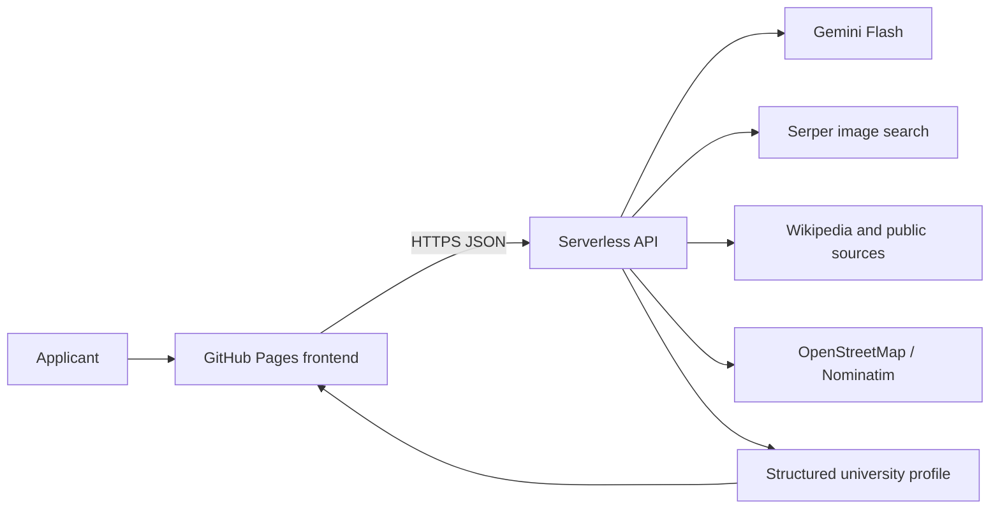

# Whirpool College Searcher

**Find the college that suits you best.** Whirpool is an AI-powered university
search and campus-profiling service created for a hackathon. It turns scattered
admissions, campus, location, and student-life information into one visual profile.

[Open the live website](https://kidwithdreams.github.io/Whirpool-College-Searcher/)

No account or test credentials are required.

## Problem

Applicants often research a university through dozens of unrelated pages. Official
marketing sites, image search, admissions requirements, maps, climate information,
and cost estimates rarely appear together. This is especially difficult for an
international applicant who cannot visit the campus before applying.

## Solution

Whirpool accepts either a university name or a natural-language question about the
student's academic profile. It returns a concise university overview, typical
admissions indicators, real campus imagery with source links, and practical context
about the surrounding city. The interface keeps uncertainty visible through
confidence scores and Verified/Unverified image labels.

Example advisor request:

> My SAT is 1350, GPA is 3.8, IELTS is 6.5. Which universities in Europe could I apply to?

## Ready components

- Responsive video landing page with a liquid-glass interface.
- University search with a structured summary and overall confidence score.
- AI admissions advisor for GPA, SAT, IELTS, region, and study preferences.
- Typical GPA, SAT, and IELTS indicators in university profiles.
- Campus image discovery with source pages and confidence labels.
- Gallery filters for Campus, Dormitories, Sports, Laboratories, Student Life,
  and City.
- Incremental **Load more** results in batches of five images.
- Location, distance-to-centre, climate, and monthly living-cost context.
- Public GitHub Pages frontend connected to a serverless API.

## User test scenario

1. Open the [live website](https://kidwithdreams.github.io/Whirpool-College-Searcher/).
2. Select **Search universities** and keep **University** mode active.
3. Enter `Nazarbayev University` and choose **Generate Profile**.
4. Confirm that a summary, admissions indicators, location data, confidence score,
   and sourced images appear.
5. Reopen the search panel, select **Advisor**, and enter the example request above.
6. Confirm that Whirpool returns a ranked shortlist with reasons and admissions fit.
7. In the gallery, switch categories and press **Load 5 more images**. Confirm that
   another batch appears and that each card links to its source.

## Architecture



The static frontend never receives provider credentials. The deployed worker reads
API keys from server-side environment variables and permits browser requests from
the published GitHub Pages origin. Search, summary, and location operations run
concurrently where possible to keep the interaction responsive.

## Technology stack

| Layer | Technology |
| --- | --- |
| Frontend | Semantic HTML, responsive CSS, vanilla JavaScript |
| Hosting | GitHub Pages |
| Production API | JavaScript serverless worker |
| AI | Gemini Flash, configurable through `GEMINI_MODEL` |
| Image discovery | Serper Images API |
| University context | Wikipedia API and public web sources |
| Location | OpenStreetMap/Nominatim and Haversine distance |
| Reference backend | Python 3.11, FastAPI, asyncio, httpx |
| Image verification research | ImageHash pHash and OpenCLIP ViT-B/32 |
| Tests | pytest for the FastAPI reference pipeline |

## API reference

### `POST /api/search`

```json
{ "university_name": "Nazarbayev University" }
```

Returns the university name, location, summary, confidence score, admissions
indicators, location/living statistics, and an array of sourced images.

### `POST /api/advice`

```json
{ "query": "My SAT is 1350, GPA is 3.8, IELTS is 6.5. Where can I apply in Europe?" }
```

Returns a student-profile interpretation and a university shortlist with fit
explanations.

### `GET /api/gallery?category=campus&page=1`

Returns five more university images for the requested gallery category. Gallery
requests do not call Gemini, which reduces token consumption.

## Data sources and verification

- Serper returns image URLs, source-page URLs, titles, and snippets.
- Official academic domains and exact university/category matches receive higher
  image-confidence scores.
- Low-confidence images are displayed as **Unverified**.
- Wikipedia and public search context support summaries and admissions information.
- Nominatim provides coordinates; Haversine distance estimates proximity to the city
  centre.
- Climate, living-cost, GPA, SAT, and IELTS values may be approximate when no precise
  source is available. They are guidance, not admission guarantees.
- Every gallery card retains a clickable source for manual verification.

## Repository structure

```text
docs/       GitHub Pages frontend and media assets
server/     Deployed serverless API
backend/    Alternative FastAPI pipeline and tests
db/         Future data-model reference; not used by the current product
```

## Local launch

### Frontend

```powershell
python -m http.server 8080 --directory docs
```

Open `http://localhost:8080`. Local API calls require adding the localhost origin
to the backend allowlist.

### FastAPI reference backend

```powershell
cd backend
python -m venv .venv
.\.venv\Scripts\Activate.ps1
pip install -r requirements.txt
Copy-Item .env.example .env
# Add fresh development keys to backend/.env; never commit that file.
uvicorn app.main:app --reload --port 8000
```

Run its tests with:

```powershell
cd backend
pytest -q
```

## Environment and security

The production server requires `GEMINI_API_KEY` and `SEARCH_API_KEY`. An optional
`SEARCH_API_KEY_FALLBACK` supports failover. Store all values in the hosting
platform's secret settings. `.env`, `.dev.vars`, archives, virtual environments,
caches, and build workspaces are excluded from Git.

`backend/.env.example` contains empty placeholders only.

## Team

**Amir (`kidwithdreams`)** — product concept, UI/UX, frontend development, backend
and AI integration, testing, and deployment.

## Current limitations and development

- Admission thresholds and costs vary by programme and year; confirm final
  requirements on the university's official website.
- Image-search confidence is a relevance signal, not proof of image ownership or
  exact capture location.
- The public Nominatim endpoint is appropriate for a hackathon demonstration, not
  high-volume production traffic.
- Accounts, subscriptions, payment limits, and favorites are intentionally excluded
  from the current hackathon scope.
- Planned improvements include university comparison, scholarships and deadlines,
  degree-level filters, multilingual results, optional favorites, and deeper
  verification against official admissions pages.

## License and asset note

This repository is a hackathon prototype. Third-party university images remain the
property of their respective owners and are shown through their source URLs. Review
asset licences before any commercial release.
